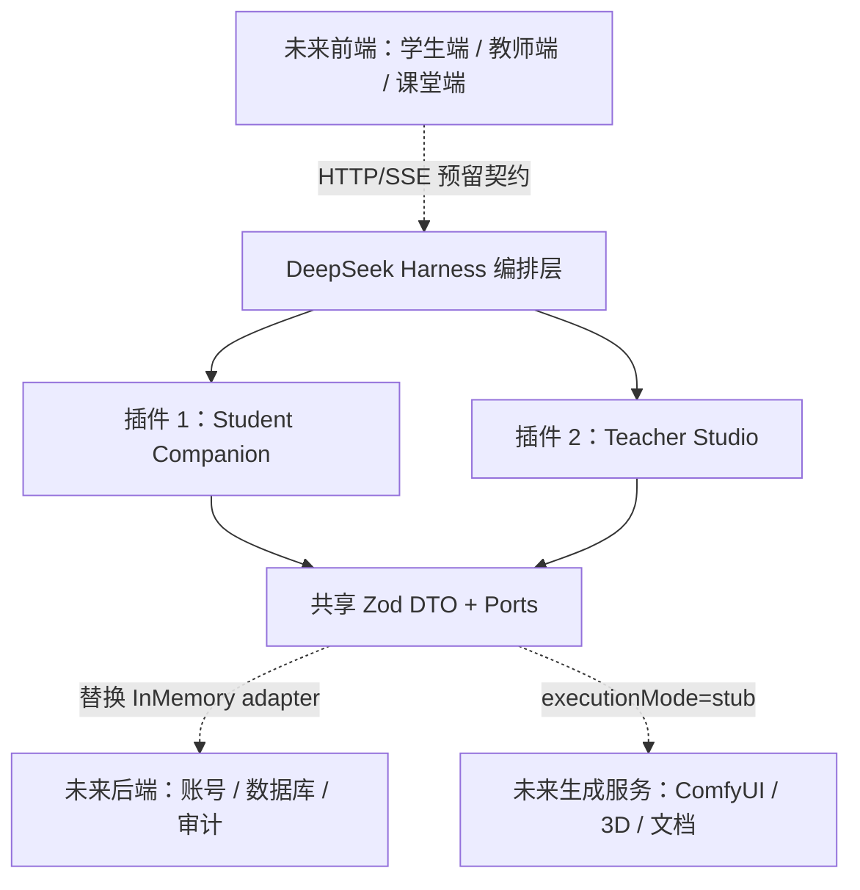

# 架构说明

## 为什么拆成两个插件

学生侧和教师侧的权限、数据暴露与终态不同。学生工具不能接触答案字段或发布权；教师工具可以形成计划和素材任务，但必须停在草案、排队或待审核状态。分开部署可以让 DSH 分别设置工具白名单、预算、日志和故障策略。

## 共享端口

`packages/contracts/src/index.ts` 定义未来后端需要实现的端口：

- `LessonContentPort`：授权课程与教师确认资料。
- `LearningRecordPort`：匿名疑点与课堂/家庭衔接快照。
- `TeachingPlanPort`：教学计划草案。
- `AssetWorkflowPort`：视频、3D、资料任务队列。
- `AuditLogPort`：来源、审核和关键动作审计。

当前 `createInMemoryPorts()` 只服务于 fixture Demo。两个独立 MCP 进程不会共享这份内存状态；接入真实后端时，应将同一组接口替换为数据库/队列适配器。

